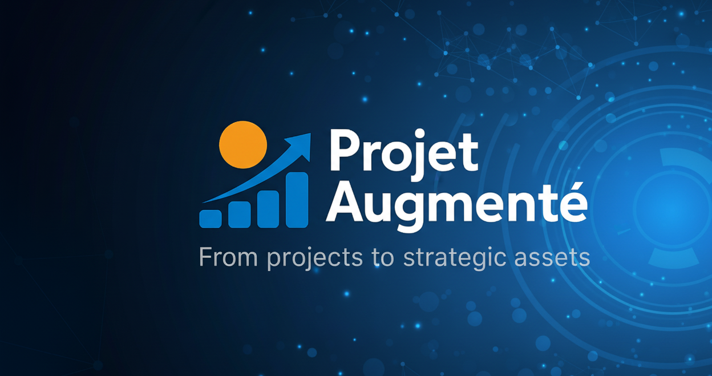

<!-- BANNIÈRE -->
<p align="center">
  
</p>

<p align="center">
    
</p>

# 🤖 PMO Chatbot - Projet Augmenté

Un chatbot expérimental développé avec **Botpress** pour tester la capacité d’un assistant à répondre de manière fiable et pédagogique sur le **PMO (Project Management Office)**.


[](https://cdn.botpress.cloud/webchat/v3.2/shareable.html?configUrl=https://files.bpcontent.cloud/2025/09/20/23/20250920230011-RY5POMNZ.json)


---

## Objectifs
- Évaluer la robustesse des réponses sur le rôle du PMO.  
- Tester la capacité du bot à éviter les **hallucinations**.  
- Fournir une **base de connaissances pédagogique et structurée** en Markdown.  
- Créer une vitrine professionnelle de compétences en **GRC, PMO, IA et gouvernance IT**.
  
---

## Structure du projet
```
pmo-chatbot/
├── README.md                        → Présentation générale du projet
├── LICENSE                          → Licence MIT
├── .gitignore                       → Fichiers/dossiers ignorés par Git
│
├── kb/                              → Knowledge Base
│   ├── KB_PMO_Chatbot.md            → KB complète (définitions, missions, livrables, pièges…)
│   └── HighLevel_Instructions_PMO.md → Instructions haut-niveau pour Botpress
│
├── tests/                           → Jeu de tests QA
│   └── QA_Test_Set.md               → 33 questions (20 factuelles, 10 pièges, 3 bonus)
│
├── docs/                            → Documentation complémentaire
│   ├── Ressources_Comparatif_Chatbot.md → Comparatif Botpress, Dialogflow, Rasa, etc.
│   ├── Mindmap_Botpress.md          → Version textuelle + légende de la mindmap
│   └── assets/                      → Visuels et captures
│       ├── Mindmap_Botpress.png     → Image de la mindmap Botpress
│       └── .gitkeep                 → (assure la présence du dossier vide si besoin)

```
---

## Protocole de test
- **20 questions factuelles** → doivent obtenir une réponse claire.  
- **10 questions pièges** → doivent générer un refus clair.  
- **3 questions bonus** → robustesse supplémentaire.  
- **Critères de succès** : ≥ 8/10 par réponse  
  - Exactitude (0-4)  
  - Périmètre (0-3)  
  - Clarté (0-2)  
  - Sobriété (0-1)  

---

## Getting Started

### 1️⃣ Prérequis
- [Node.js](https://nodejs.org/) ≥ 18  
- [Botpress Cloud](https://botpress.com/) ou Botpress local  
- Git installé pour cloner le repo  

### 2️⃣ Installation
Clonez le repo :
```bash
git clone https://github.com/Eddyazebaze/pmo-chatbot.git
cd pmo-chatbot
```

### 3️⃣ Importer la KB dans Botpress
- Ouvrir Botpress Cloud ou votre instance locale.  
- Importer le fichier `kb/KB_PMO_Chatbot.md`.  
- Ajouter `kb/HighLevel_Instructions_PMO.md` dans les **Instructions système**.  

### 4️⃣ Lancer le chatbot
- Configurez le canal **Webchat** dans Botpress.  
- Déployez et testez via l’interface Botpress.  
- Utilisez `tests/QA_Test_Set.md` pour valider la cohérence des réponses.  

### 5️⃣ Vérification
- Réponses factuelles → doivent être précises et pédagogiques.  
- Questions pièges → le bot doit refuser proprement.  
- Bonus → confirmer la robustesse de la KB.  

---

## Stack utilisée
- [Botpress](https://botpress.com/) - plateforme low-code pour chatbots  
- **Markdown** - structuration de la KB  
- **GitHub** - gestion de version et documentation  

---

## Roadmap
- [ ] Ajouter la version enrichie de la KB (livrables + cas concrets).  
- [ ] Déployer une démo publique du bot.  
- [ ] Ajouter des scénarios de test automatisés.  
- [ ] Créer un tableau de suivi (GitHub Projects) pour tracer les évolutions.  

---

## Limites
- Ce bot est expérimental.  
- Ne couvre pas les cas spécifiques (RH, contrats, réglementations locales).  
- Pour toute précision métier → escalade vers un expert humain.  

---

## Passer à l’action

Ce projet est conçu par **Eddy AZEBAZE, PMP®, CISM®** - **Chef de projet IT & PMO stratégique**, spécialisé en **gestion de projets complexes**, **data**, **IA responsable**, **conformité réglementaire** (AI Act, RGPD, NIS2, DORA) et **gouvernance IT orientée valeur**.  

- 👉 [Réserver 30 min](https://calendly.com/eddy-azebaze-proton/30min)  
- 👉 [LinkedIn](https://www.linkedin.com/in/eddy-azebaze-pmp-cism)  
- 👉 [Email direct](mailto:eddy.azebaze@proton.me)  
- 👉 [Medium](https://medium.com/@eddyazebaze)  

---

> *«💡 « On ne livre pas un projet. On construit un actif stratégique : durable, traçable et auditable. »

---

## 📜 Licence
Projet sous licence **MIT** - libre pour usage et adaptation, avec attribution.  


