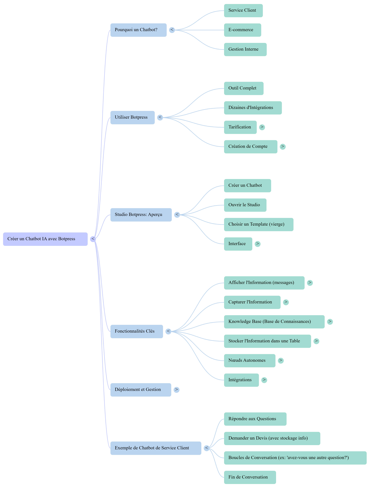

# 🌸 Mindmap - Créer un Chatbot IA avec Botpress

Vue d’ensemble du parcours présenté : Pourquoi un chatbot, Utiliser Botpress, Aperçu du Studio, Fonctionnalités Clés, Déploiement et Exemple Service Client.

---

## 🖼️ Visuel

> 🔗 Si l’image ne s’affiche pas, tu peux aussi l’ouvrir directement ici :  
> [Voir l’image Mindmap Botpress](https://github.com/Eddyazebaze/pmo-chatbot/blob/main/docs/assets/Mindmap_Botpress.png)

---

## ⚡ Légende rapide

### **Pourquoi un Chatbot ?**
- Service client, e-commerce, gestion interne.

### **Utiliser Botpress**
- Outil complet, dizaines d’intégrations, tarification cloud, création de compte simple.

### **Studio Botpress (aperçu)**
- Créer un bot, ouvrir le studio, choisir un template, comprendre l’interface.

### **Fonctionnalités Clés**
- Afficher/Capturer l’information, Knowledge Base (RAG), stocker dans une Table, nœuds autonomes, intégrations.

### **Déploiement et Gestion**
- Webchat/iframe, configuration, monitoring.

### **Exemple Service Client**
- Répondre aux questions, demander un devis (avec stockage), boucles de conversation, fin de conversation.

---

## 📎 Ressources associées
- [📘 Knowledge Base PMO](../kb/KB_PMO_Chatbot.md)  
- [⚙️ High-Level Instructions](../kb/HighLevel_Instructions_PMO.md)  
- [🧪 Jeu de tests (33 questions)](../tests/QA_Test_Set.md)  
- [📊 Ressources & Comparatif](./Ressources_Comparatif_Chatbot.md)  

---

✏️ *Ce mindmap est un complément pédagogique : il ne remplace pas la documentation détaillée, mais offre une vue synthétique du flux de travail dans Botpress.*
