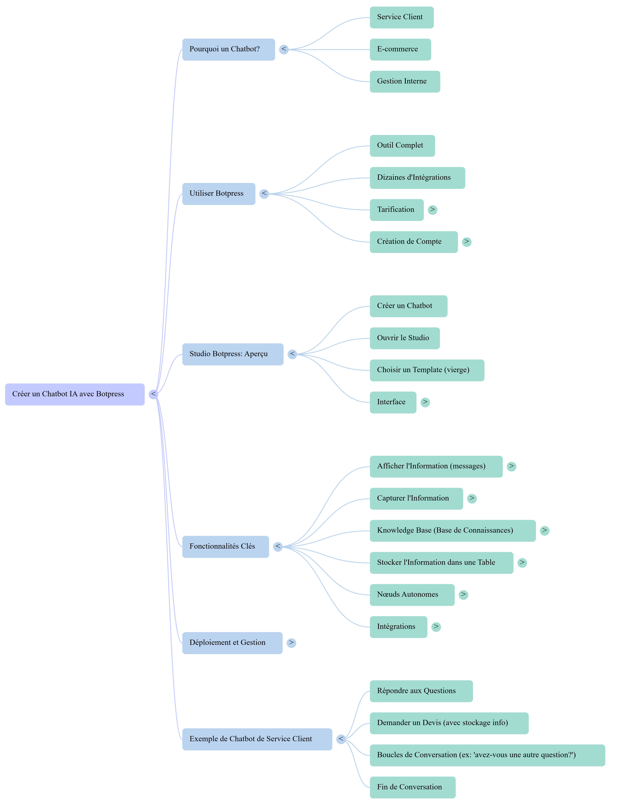

# 📑 Ressources & Comparatif - Solutions Chatbot (No‑Code / Low‑Code)

# 🌸 Mindmap - Créer un Chatbot IA avec Botpress

Vue d’ensemble du parcours présenté : Pourquoi un chatbot, Utiliser Botpress, Aperçu du Studio, Fonctionnalités Clés, Déploiement et Exemple Service Client.

---

## 🖼️ Visuel

> 🔗 Si l’image ne s’affiche pas, tu peux aussi l’ouvrir directement ici :  
> [Voir l’image Mindmap Botpress](https://github.com/Eddyazebaze/pmo-chatbot/blob/main/docs/assets/Mindmap_Botpress.png)

---

## ⚡ Légende rapide

### **Pourquoi un Chatbot ?**
- Service client, e-commerce, gestion interne.

### **Utiliser Botpress**
- Outil complet, dizaines d’intégrations, tarification cloud, création de compte simple.

### **Studio Botpress (aperçu)**
- Créer un bot, ouvrir le studio, choisir un template, comprendre l’interface.

### **Fonctionnalités Clés**
- Afficher/Capturer l’information, Knowledge Base (RAG), stocker dans une Table, nœuds autonomes, intégrations.

### **Déploiement et Gestion**
- Webchat/iframe, configuration, monitoring.

### **Exemple Service Client**
- Répondre aux questions, demander un devis (avec stockage), boucles de conversation, fin de conversation.

---

✏️ *Ce mindmap est un complément pédagogique : il ne remplace pas la documentation détaillée, mais offre une vue synthétique du flux de travail dans Botpress.*

## Formation utilisée
- YouTube (juillet 2025) - *[Créer un chatbot IA avec Botpress (2024/2025)](https://www.youtube.com/watch?v=nDdDs-z5HxU)*  
- Format : no‑code, interface Botpress Cloud
- Durée : ~1heure

## Tableau comparatif (synthèse)
| Critère            | Botpress        | Dialogflow     | Rasa          | Tawk.to / autres |
|--------------------|-----------------|----------------|---------------|------------------|
| No‑code            | ✅ Oui          | ⚠️ Partiel     | ❌ Non        | ✅ Oui           |
| Coût (entrée)      | ✅ Faible       | ⚠️ Limité      | ✅ Gratuit*   | ✅ Gratuit       |
| Complexité         | ✅ Faible       | ⚠️ Moyenne     | ❌ Élevée     | ✅ Très faible   |
| Intégrations web   | ✅ Iframe/Web   | ✅ Google      | ⚠️ Sur‑mesure | ✅ Web           |
| Focus              | MVP, webchat    | Entreprise CX  | IA avancée    | Support simple   |

\* Rasa nécessite souvent des compétences Python/infra.

## Pourquoi Botpress pour ce projet
- No‑code fluide, 
- Déploiement rapide (iframe, CDN).  
- Documentation claire + écosystème.
- Pas de limitation d’usage (contrairement à Dialogflow : 180 req/min)
- Bon alignement avec l’objectif : **démontrer** un assistant IA propre et fiable.

## Plan d’action recommandé
1. Choisir la plateforme (ici : Botpress) + définir structure des cas d’usage.  
2. Créer l’arborescence **KB / Instructions / Tests / Docs** (ce dépôt).  
3. Intégrer, tester, itérer (logs → amélioration KB).

## Liens utiles
- [Botpress Docs](https://botpress.com/docs/)
- [Dialogflow Docs](https://cloud.google.com/dialogflow/docs)
- [Rasa](https://rasa.com/)
- [Tawk.to](https://www.tawk.to/)
- [Landbot](https://landbot.io/)

---

## 📎 Ressources associées
- [📘 Knowledge Base PMO](../kb/KB_PMO_Chatbot.md)  
- [⚙️ High-Level Instructions](../kb/HighLevel_Instructions_PMO.md)  
- [🧪 Jeu de tests (33 questions)](../tests/QA_Test_Set.md)  
- [📊 Ressources & Comparatif](./Ressources_Comparatif_Chatbot.md)  
